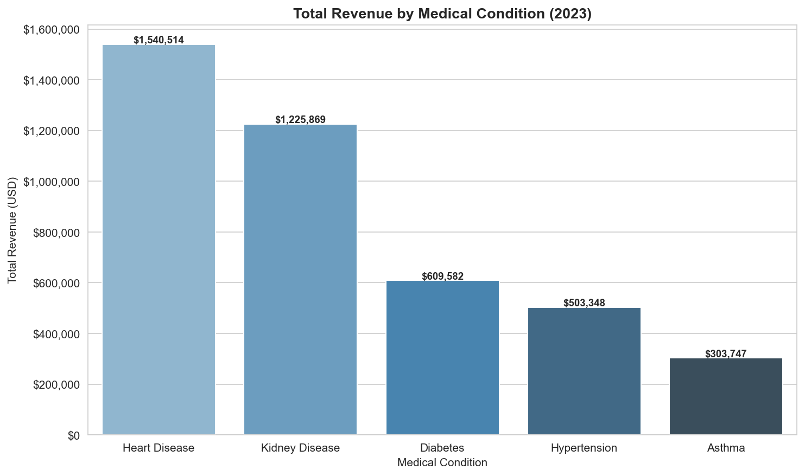
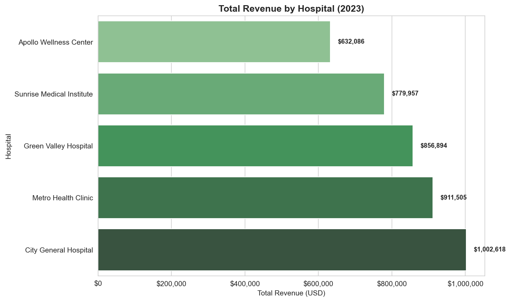
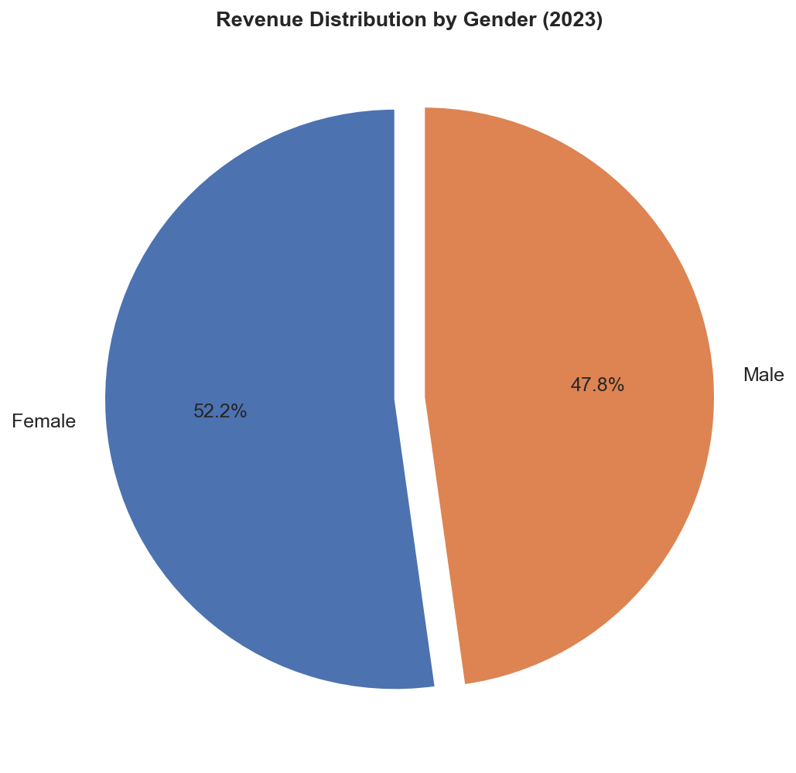
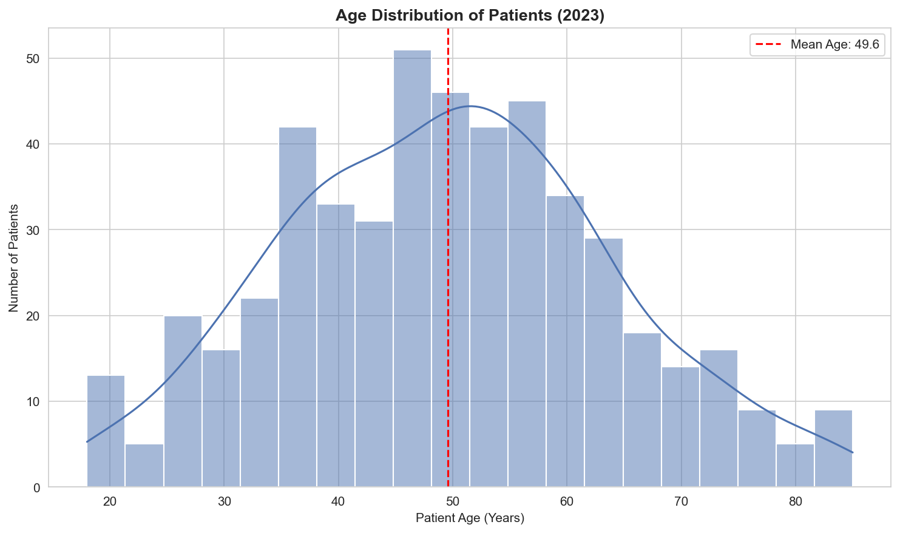
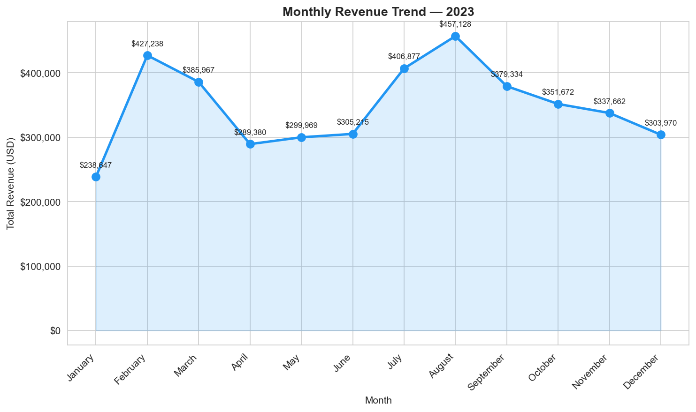
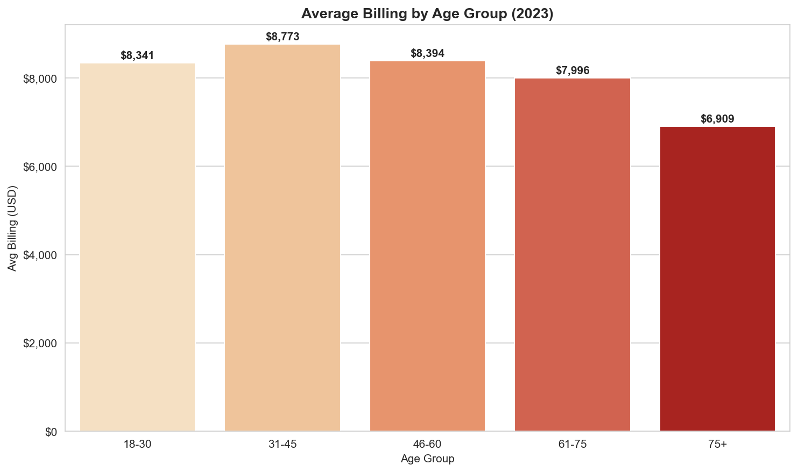
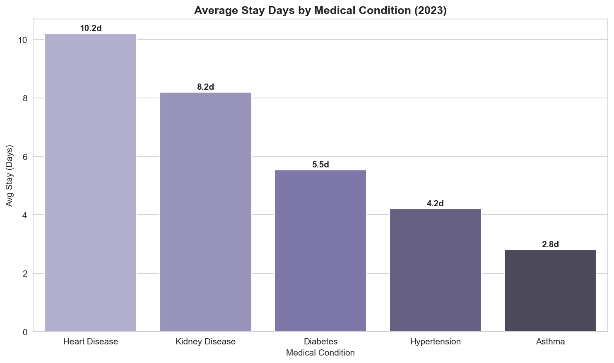

# Healthcare Patient & Revenue Analysis

An analytics project on patient admission and billing data across 5 hospitals for the year 2023.
Built using Python, MySQL, and Power BI.

---

## What I wanted to find out

- Which medical condition generates the most revenue?
- Which hospital handles the most patients?
- How does billing vary across age groups and gender?
- Are there any patterns in monthly admissions?
- What is the average hospital stay per condition?

---

## Dataset

500 patient records with the following fields:

| Column | Description |
|--------|-------------|
| Patient_ID | Unique patient identifier |
| Age | Patient age (18–85) |
| Gender | Male / Female |
| Blood_Type | Blood group |
| Medical_Condition | Diabetes, Hypertension, Heart Disease, Asthma, Kidney Disease |
| Hospital | One of 5 hospitals |
| Insurance_Provider | Insurance company name |
| Admission_Type | Emergency / Urgent / Elective |
| Admission_Date | Date of admission |
| Discharge_Date | Date of discharge |
| Stay_Days | Length of hospital stay |
| Billing_Amount | Total bill in USD |

---

## Key Numbers

| Metric | Value |
|--------|-------|
| Total Patients | 500 |
| Total Revenue | $4,183,059.95 |
| Average Billing | $8,366.12 |
| Median Billing | $6,501.42 |
| Average Stay | 6.2 days |

---

## Tech Stack

- **Python** — Pandas, NumPy, Matplotlib, Seaborn
- **MySQL** — data storage and SQL queries
- **Power BI** — interactive dashboard

---

## Project Structure

```
Healthcare-Analytics-Project/
├── data/
│   └── healthcare_data.csv
├── sql/
│   └── healthcare_analysis.sql
├── notebook/
│   └── healthcare_analysis.py
├── dashboard/
│   └── Healthcare_Dashboard.pbix    ← add after building in Power BI
├── screenshots/
│   ├── chart1_revenue_by_condition.png
│   ├── chart2_revenue_by_hospital.png
│   ├── chart3_revenue_by_gender.png
│   ├── chart4_age_distribution.png
│   ├── chart5_monthly_revenue_trend.png
│   ├── chart6_avg_billing_by_age_group.png
│   └── chart7_avg_stay_by_condition.png
├── README.md
└── requirements.txt
```

---

## How to Run

**Python analysis:**
```bash
pip install -r requirements.txt
python notebook/healthcare_analysis.py
```

**MySQL:**
1. Open `sql/healthcare_analysis.sql` in MySQL Workbench
2. Run the CREATE TABLE section
3. Import `data/healthcare_data.csv` using Table Data Import Wizard
4. Run the remaining queries

**Power BI:**
- Open Power BI Desktop
- Get Data → Text/CSV → select `data/healthcare_data.csv`
- Build charts using the fields pane

---

## Charts









---

## Key Findings

- Heart Disease has the highest average billing at **$15,882** and the longest average stay at ~10 days
- Asthma is the lowest cost condition at **$3,302** average with stays of ~3 days
- Mean billing ($8,366) is higher than median ($6,501) — indicating the data is right-skewed by a few high-cost patients
- City General Hospital treated the most patients (119); Apollo Wellness Center the fewest (80)
- Gender split is roughly 50/50 with no significant revenue gap between male and female patients
- Revenue is fairly consistent across all 12 months with no strong seasonal peak

---

## Author

[Your Name] | B.Tech Final Year
[LinkedIn] | [Email]
